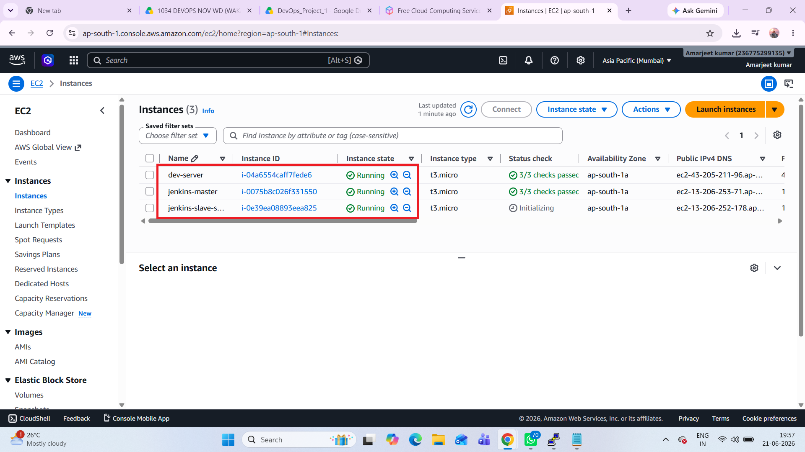
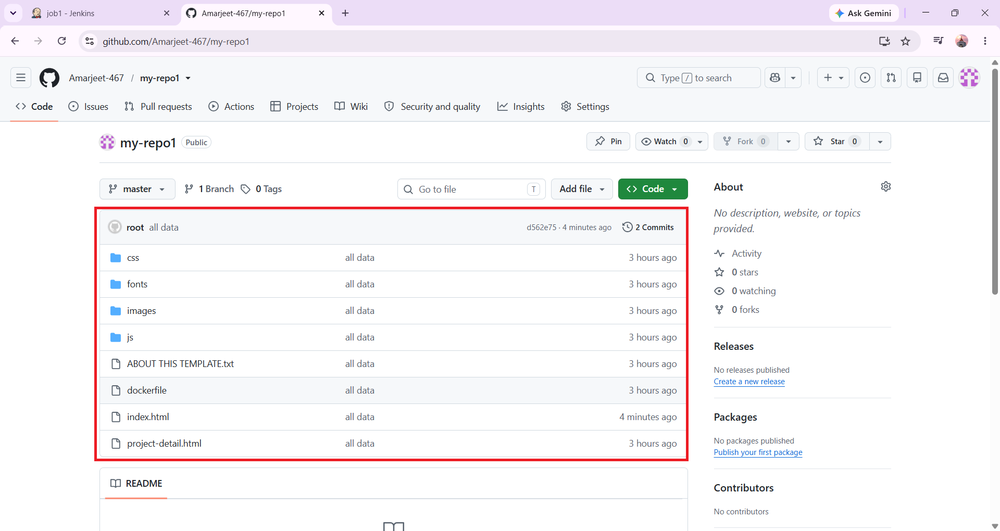
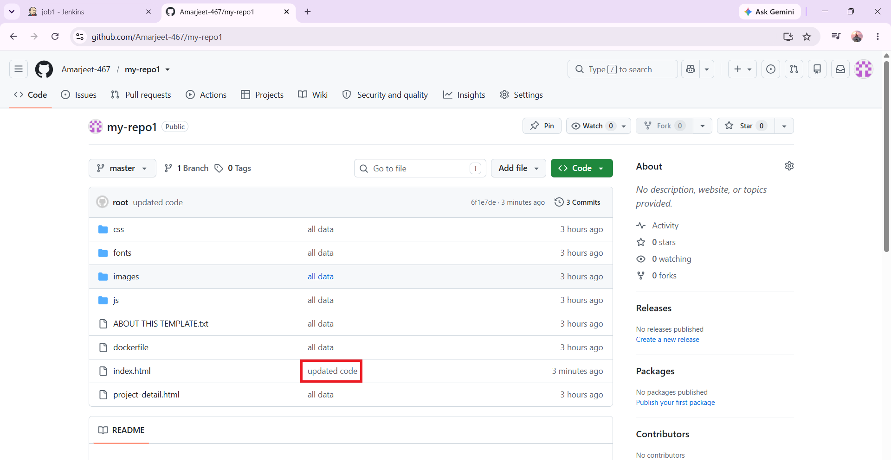
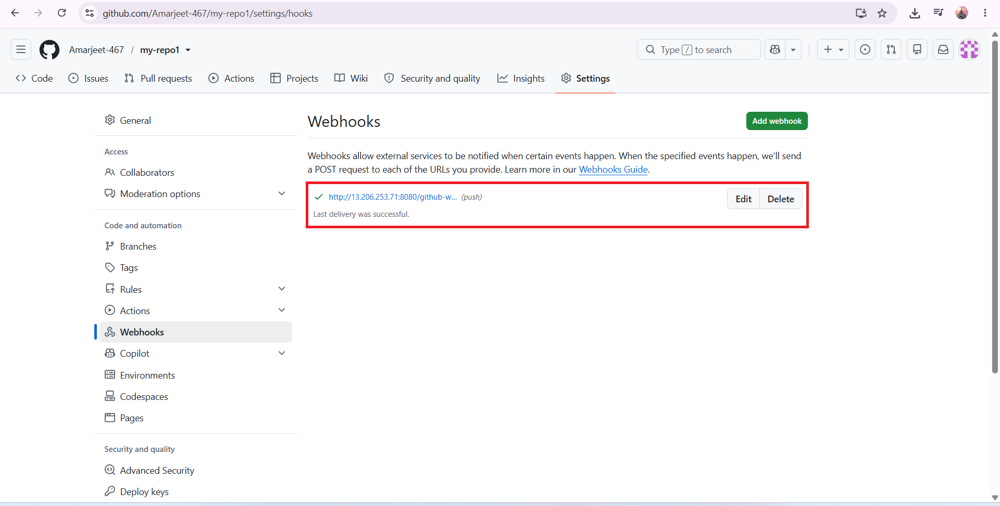
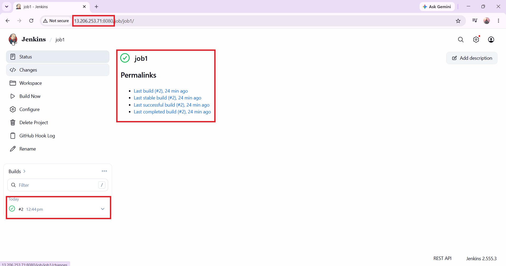
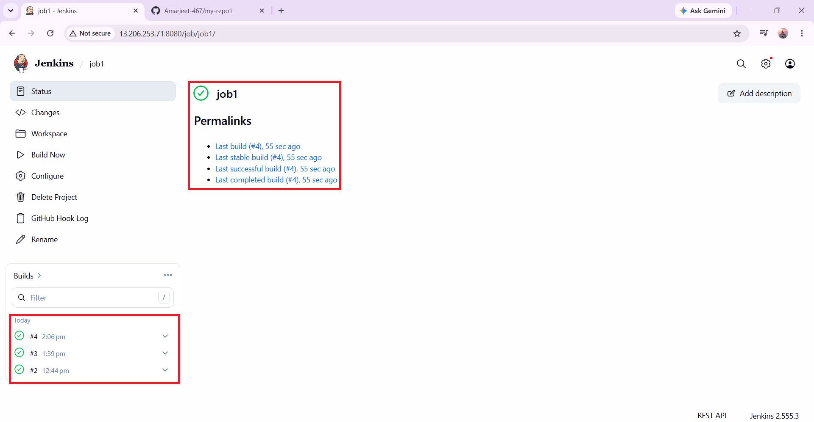
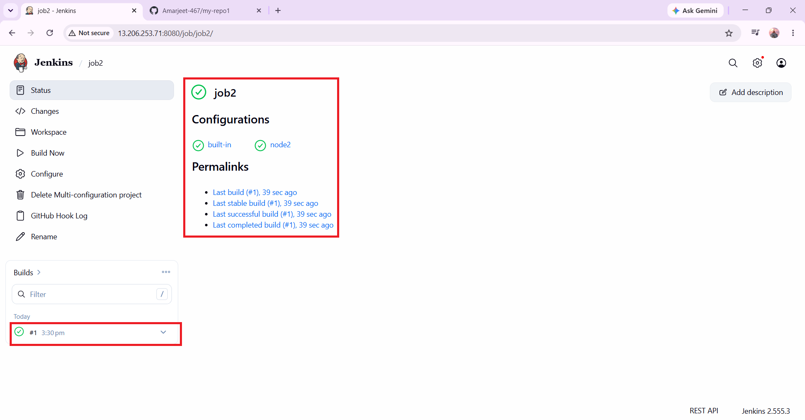

# 🚀 AWS DevOps CI/CD Pipeline for Static Website Deployment

## 📌 Project Summary

 In this project, I developed an **end-to-end CI/CD pipeline** to automate the deployment of a static website using **AWS EC2,GitHub,GitHub Webhooks,Jenkins and Docker**.The source code is stored in a GitHub repository, and whenever I push code,  GitHub Webhooks automatically trigger a Jenkins Freestyle Job. Jenkins pulls the latest code and uses a Multi-Configuration Job to deploy it simultaneously on both the Jenkins Master and a JNLP-connected Jenkins Agent running on AWS EC2 instances. Docker is used to containerize the application, ensuring consistent deployments. This project helped me gain hands-on experience with GitHub, Jenkins,GithHub Webhooks, Docker, AWS EC2, Jenkins Master-Agent architecture, and CI/CD automation while reducing manual deployment efforts by implementing an automated, reliable, and repeatable CI/CD deployment workflow. 

## 🎯 Project Objectives

- Automate website deployment using Jenkins.
- Integrate GitHub with Jenkins using Webhooks.
- Deploy the same website simultaneously on both the Jenkins Master and JNLP connected Agent.
- Learn CI/CD pipeline implementation.
- Understand Jenkins Master-Agent architecture.
- Perform distributed builds using Multi-Configuration Jobs.
- To reduce manual deployment efforts by creating an automated, reliable, and repeatable deployment workflow.

## 🛠️ Technologies Used

| Technology | Purpose |
|------------|---------|
| AWS EC2 | Hosting Jenkins Master, Agent and Developer Server |
| Jenkins | CI/CD Automation |
| Git | Version Control |
| GitHub | Source Code Repository |
| GitHub Webhooks | Automatic Build Trigger |
| Docker | Containerized Deployment |
| HTML | Static Website |
| CSS | Website Styling |
| JavaScript | Website Functionality |
| Linux (Ubuntu) | Server Operating System |

## 🏗️ Project Architecture

Developer

⬇

GitHub Repository

⬇ (GitHub Webhook)

Jenkins Master

⬇

Jenkins Agent (JNLP)

⬇

Docker Container

⬇

Website Deployment on Jenkins Master

AND

Website Deployment on Jenkins Agent

## 🔄 CI/CD Workflow

1. Developer pushes code to GitHub.
2. GitHub Webhook automatically triggers Jenkins.
3. Jenkins pulls the latest source code.
4. Jenkins builds the project.
5. Docker image is created.
6. Docker container starts.
7. Website is deployed on Jenkins Master.
8. Website is deployed on Jenkins Agent.
9. Multi-Configuration Job executes builds on both servers.

## ✨ Key Features

✅ Jenkins Freestyle Job

✅ Jenkins Multi-Configuration Job

✅ GitHub Webhook Integration

✅ Docker Deployment

✅ AWS EC2 Infrastructure

✅ Jenkins Master-Agent Architecture

✅ Automatic Website Deployment

✅ Distributed Build Execution

## 📂 Repository Structure
.
├── css/
├── fonts/
├── images/
├── js/
├── screenshots
├── Dockerfile
├── index.html
├── project-detail.html
└── README.md

## 📷 Project Screenshots

### AWS EC2 Instances 

### GitHub Repository

### GitHub Webhook Configuration

### Jenkins Freestyle Job (Master)

### Jenkins Freestyle Job (Agent)

### Multi-Configuration Job (Master & Node)

### Website Successfully Running on Jenkins Master before code chnages

### Website Successfully Running on Jenkins Master after code changes

### Website Successfully Running on Jenkins Agent before code chnages

### Website Successfully Running on Jenkins Agent after code changes

(Add Screenshot)

## 📈 Skills Demonstrated

- AWS EC2 Management
- Jenkins Installation & Configuration
- Jenkins Master-Agent Setup (JNLP)
- Git & GitHub
- GitHub Webhooks
- Docker Basics
- CI/CD Pipeline
- Linux Commands
- Static Website Deployment
- Multi-Configuration Jobs

## 💡 Challenges Faced

- Configuring Jenkins Agent using JNLP.
- Connecting GitHub Webhooks with Jenkins.
- Deploying website simultaneously on multiple servers.
- Creating Multi-Configuration Jobs.

## 👨‍💻 Author

**Amarjeet Kumar**

AWS DevOps Fresher

GitHub: https://github.com/Amarjeet-467

---

⭐ Thank you for visiting this repository.
